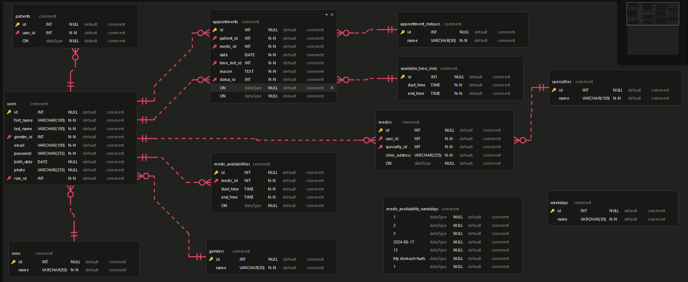

# *MediCare*
## Tipo de Manual:
Técnico
## Versión del sistema: 
V 1.0
## Fecha de Elaboración: 
Junio 2024
## Desarrollado por: 
Grupo 1, Análisis y diseño de sistemas 1, Departamento de Informática, Ingeniería en Ciencias y Sistemas, Universidad de San Carlos de Guatemala.
> -  **Mariano Francisco Camposeco Camposeco - 202030987**
> -  **Erick Estuardo Patzan Polanco    - 201602627**
> -  **María Cecilia Cotzajay López - 201602659**
> -  **Joshua Estuardo Franco Equite - 201708845**
> -  **Bilhán Jehiel López Miranda - 201612369**

## Objetivos del proyecto
### Objetivo General
- Proveer una plataforma integral de gestión de citas médicas en línea que mejore la comunicación entre médicos y pacientes, facilite la programación y seguimiento de citas, y optimice la administración de horarios y especialidades médicas.
### Objetivos especificos:
- Implementar un sistema seguro y eficiente de autenticación y gestión de usuarios.
- Desarrollar un módulo de gestión administrativa para médicos y citas.
- Integrar servicios de notificaciones y comunicación eficaces.
## Descripción del proyecto
***MediCare*** es una plataforma en línea diseñada para facilitar la gestión de pacientes y la comunicación entre médicos y pacientes. Permite la programación de citas, la gestión de horarios médicos, y el envío de notificaciones sobre las citas mediante servicios de AWS.
## Fundamentación de la tecnología utilizada
> - **Frontend:** React
> - **Backend:** Node js con Expresss.js
> - **Servicio de Base de datos:** AWS RDS, DBMS: MySQL

## Funcionalidades Principales
- **Autenticación y Gestión de Usuarios:**
  - **Registro y login seguro:** Los usuarios (pacientes y médicos) pueden registrarse y acceder al sistema de forma segura mediante autenticación basada en contraseñas.
  - **Recuperación de contraseña:** Los usuarios pueden recuperar sus contraseñas mediante un proceso seguro de recuperación.
  - **Actualización de información personal:** Los usuarios pueden actualizar su información personal y médica.
  - **Asignación de roles:** El sistema permite la asignación de roles específicos (Paciente, Médico) que determinan los permisos y accesos dentro de la plataforma.

- **Gestión de Pacientes y Médicos:**
  - **Creación y administración de perfiles:** Los perfiles de pacientes y médicos son creados y administrados, incluyendo información médica relevante y datos personales.
  - **Visualización de información:** Los usuarios pueden visualizar la información médica y personal en sus perfiles.

- **Gestión de Citas Médicas:**
  - **Programación de citas:** Los pacientes pueden programar citas médicas seleccionando el médico y el horario deseado.
  - **Confirmación, modificación y cancelación de citas:** Los usuarios pueden confirmar, modificar y cancelar citas según sea necesario.
  - **Historial de citas:** Los pacientes y médicos pueden acceder a un historial detallado de citas pasadas y futuras.

- **Gestión de Horarios y Disponibilidades:**
  - **Configuración de horarios disponibles:** Los médicos pueden configurar sus horarios de disponibilidad para la programación de citas.
  - **Visualización de disponibilidad:** Los pacientes pueden ver la disponibilidad de los médicos para seleccionar horarios adecuados para sus citas.
  - **Gestión de disponibilidad por días y horas:** Los médicos pueden especificar su disponibilidad por días de la semana y horas específicas.

- **Notificaciones y Recordatorios:**
  - **Envío de correos electrónicos:** Utilizando Amazon SES, se envían correos electrónicos de confirmación de citas y otros eventos importantes.
  - **Notificaciones instantáneas:** Amazon SNS se utiliza para enviar recordatorios y notificaciones instantáneas sobre citas y eventos importantes.
  - **Alertas y recordatorios automáticos:** El sistema envía automáticamente alertas y recordatorios para próximas citas o cambios en las mismas.

- **Gestión de Especialidades Médicas:**
  - **Administración de especialidades:** Se gestionan las diferentes especialidades médicas disponibles en la plataforma.
  - **Asignación de especialidades:** Los médicos pueden ser asignados a una o más especialidades, facilitando la búsqueda de especialistas por parte de los pacientes.

- **Panel de Administración para Médicos:**
  - **Gestión de citas y horarios:** Los médicos tienen acceso a un panel de control donde pueden gestionar sus citas y horarios de disponibilidad.
  - **Visualización de lista de pacientes:** Los médicos pueden ver la lista de sus pacientes y los detalles de las citas programadas.
  - **Herramientas de actualización:** Los médicos pueden actualizar su disponibilidad y la información de la clínica.

## Diagramas de Modelamiento
### Modelo Entidad Relacion (ERD)
El diagrama describe las entidades y sus relaciones dentro del sistema de gestión de citas médicas de MediCare. Este diagrama es fundamental para la estructura de la base de datos, ya que define cómo se almacenan y conectan las entidades descritas, asegurando la integridad referencial y facilitando la consulta eficiente de los datos.

  

### Diagrama de Clases
El diagrama esta basado en el modelo entidad relacion. Cada clase corresponde a una entidad en el ERD, define sus atributos y métodos. Este diagrama es fundamental para la implementación del sistema, ya que proporciona una estructura clara para la lógica del negocio y la interacción con la base de datos.

  

### Diagama de Componentes
El diagrama está basado en el diagrama de clases. Muestra la organización y la relación entre los componentes de software del sistema. Este diagrama proporciona una visión clara de la arquitectura del software, facilitando la comprensión de la distribución de responsabilidades y la comunicación entre los diferentes módulos o componentes del sistema. Incluye la interacción entre los módulos de gestión de usuarios, gestión de citas, y el uso de servicios de AWS como RDS para la base de datos y SES para el envío de notificaciones por correo electrónico.

  

### Diagrama de Despliegue
El diagrama está basado en el diagrama de componentes. Proporciona una visión clara de la infraestructura necesaria para ejecutar el sistema, incluyendo detalles sobre la comunicación entre los servidores, la base de datos y los servicios de notificaciones. Este diagrama asegura que todos los componentes del sistema estén correctamente conectados y desplegados para ofrecer un rendimiento óptimo, utilizando AWS RDS para la base de datos y AWS SES para el envío de notificaciones por correo electrónico

  

## Mockups del Sistema
 - ### Login:

 - ### Registro:

 - ### Citas horarios médico:

 - ### Página principal médico:

 - ### Página principal paciente:

 - ### Actualizar perfil paciente:

 - ### Vista horario médico desde paciente:

 - ### Programar cita paciente:

 - ### Lista citas activas paciente:

 - ### Historial de citas paciente:
